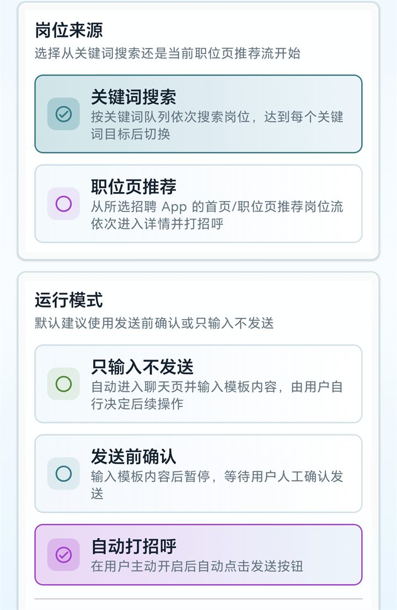
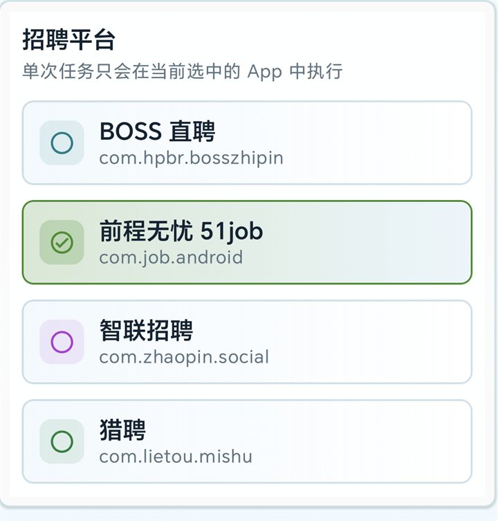

<div align="center">

# 职引助手 JobGuide

面向 Android 的多招聘平台求职自动化辅助工具，基于无障碍服务帮助你按规则筛选岗位、填写打招呼模板并控制每日沟通节奏。

<p>
  
  
  
  
  
  <a href="LICENSE"></a>
</p>

<p>
  <a href="#features">功能亮点</a> ·
  <a href="#screenshots">应用截图</a> ·
  <a href="#quick-start">快速开始</a> ·
  <a href="#configuration">配置说明</a> ·
  <a href="#architecture">技术架构</a> ·
  <a href="#safety">安全边界</a> ·
  <a href="#roadmap">Roadmap</a>
</p>

</div>

---

> JobGuide 不是任何招聘平台的官方客户端，不调用非公开接口，不保存账号密码，也不会绕过验证码、登录校验或安全验证。请遵守相关平台条款和当地法律法规，优先使用“发送前确认”或“只输入不发送”模式。

## 功能亮点

- **多平台适配**：支持 BOSS 直聘、前程无忧 51job、智联招聘、猎聘等主流招聘 App。
- **关键词队列**：按关键词顺序搜索岗位，并为每个关键词独立设置处理数量和沟通上限。
- **岗位筛选规则**：基于城市、薪资、白名单、黑名单、必备关键词和最低评分自动跳过不匹配岗位。
- **模板化打招呼**：支持 `{name}`、`{job_title}`、`{company}`、`{city}`、`{salary}`、`{skills}`、`{keyword}` 等变量。
- **三种运行模式**：只输入不发送、发送前确认、自动打招呼，方便从低风险模式逐步试用。
- **风险自动停止**：识别验证码、安全验证、账号异常、操作频繁等提示后停止任务。
- **任务统计与记录**：展示今日处理岗位、成功沟通、剩余额度，并记录运行日志和岗位处理结果。
- **配置导入导出**：使用 JSON 备份和恢复完整配置，便于多设备同步。

## 应用截图

| 执行总览 | 运行模式 |
|:---:|:---:|
|  |  |
| 查看自动打招呼开关、任务配置、筛选规则和无障碍权限状态。 | 在关键词搜索与推荐流之间切换，并选择只输入、确认后发送或自动发送。 |

| 平台选择 | 执行控制台 |
|:---:|:---:|
|  |  |
| 为单次任务选择目标招聘平台，避免跨平台混跑。 | 跟踪今日进度、当前来源、剩余额度，并手动开始、暂停或停止任务。 |

## 支持平台

| 平台 | Android 包名 | 搜索方式 | 推荐运行模式 |
|:---|:---|:---:|:---:|
| BOSS 直聘 | `com.hpbr.bosszhipin` | 关键词搜索 / 推荐流 | 发送前确认 |
| 前程无忧 51job | `com.job.android` | 关键词搜索 | 只输入不发送 |
| 智联招聘 | `com.zhaopin.social` | 关键词搜索 | 只输入不发送 |
| 猎聘 | `com.lietou.mishu` | 关键词搜索 | 发送前确认 |

平台页面结构可能随 App 版本变化而调整。首次使用某个平台时，建议先用低风险模式验证流程。

## 快速开始

### 环境要求

- Android Studio Hedgehog 或更高版本
- Android 7.0 及以上设备或模拟器，API 24+
- 已安装目标招聘平台 App
- 手动开启 JobGuide 的无障碍服务权限

### 编译安装

```bash
# 克隆仓库
git clone https://github.com/CODE-OF-ZHANG/JobGuide.git
cd JobGuide

# 编译 Debug APK
./gradlew assembleDebug

# 输出位置
# app/build/outputs/apk/debug/app-debug.apk
```

也可以用 Android Studio 直接打开项目，等待 Gradle 同步完成后点击 Run。

### 使用流程

1. 安装并打开职引助手。
2. 在“我的”页或“执行”页进入系统设置，开启职引助手无障碍服务。
3. 在“关键词”页添加搜索关键词，并设置每个关键词的处理上限和沟通上限。
4. 在“规则”页配置目标城市、薪资范围、白名单、黑名单和风险停止词。
5. 在“模板”页编写打招呼文案，按需使用变量占位符。
6. 在“执行”页选择招聘平台、岗位来源和运行模式。
7. 建议先选择“发送前确认”，确认流程稳定后再考虑更自动化的模式。

## 配置说明

### 关键词配置

每个关键词可以单独控制是否启用、处理岗位数量、打招呼数量上限和执行顺序。适合同时投递多个方向，例如“软件测试”“AI 开发”“人工智能”等。

### 规则配置

| 配置项 | 作用 |
|:---|:---|
| 目标城市 | 只处理指定城市的岗位 |
| 薪资范围 | 跳过不在期望范围内的岗位 |
| 必备关键词 | 岗位信息必须包含指定关键词 |
| 岗位白名单 | 命中后增加匹配评分 |
| 岗位黑名单 | 命中后直接跳过 |
| 风险停止词 | 检测到验证码、安全验证等内容时停止任务 |
| 每日总上限 | 限制每天最多发送的打招呼次数 |
| 随机间隔 | 控制两次操作之间的等待时间 |
| 最低评分 | 低于分数线的岗位不处理 |

### 模板变量

| 变量 | 替换内容 |
|:---|:---|
| `{name}` | 求职者姓名 |
| `{job_title}` | 岗位名称 |
| `{company}` | 公司名称 |
| `{city}` | 城市 |
| `{salary}` | 薪资范围 |
| `{skills}` | 技能标签 |
| `{keyword}` | 当前搜索关键词 |

### JSON 导入导出

在“我的”页可以导入或导出完整 JSON 配置，用于备份、迁移或在多台设备之间同步。

## 安全边界与免责声明

JobGuide 的目标是辅助用户减少重复操作，不是批量骚扰工具，也不是绕过平台风控的工具。

- 不保存招聘平台账号、密码、验证码或登录态。
- 不调用招聘平台的非公开接口。
- 不绕过验证码、登录异常、安全校验或风控提示。
- 检测到风险停止词、找不到关键按钮或页面状态异常时会停止任务。
- 不建议无人值守高频运行，建议设置较低每日上限并使用随机间隔。
- 使用者需要自行遵守招聘平台使用条款、隐私政策和当地法律法规。

本项目仅供学习和研究使用。因使用本项目造成的账号限制、平台处罚或其他后果，均由使用者自行承担。

## 技术架构

```text
┌──────────────────────────────────────────────┐
│ Jetpack Compose UI                           │
│ JobGuideApp / JobGuideViewModel              │
└──────────────────────┬───────────────────────┘
                       │ issueCommand
                       ▼
┌──────────────────────────────────────────────┐
│ DataStore Preferences                        │
│ AppConfig / RunStats / Logs / Records        │
└───────────────┬──────────────────────▲───────┘
                │ collect command      │ state flow
                ▼                      │
┌──────────────────────────────────────────────┐
│ AccessibilityService                         │
│ JobGuideAccessibilityService                 │
└──────────────────────┬───────────────────────┘
                       │
                       ▼
┌──────────────────────────────────────────────┐
│ Automation Engine                            │
│ PageHeuristics / JobMatcher / NodeExt        │
└──────────────────────┬───────────────────────┘
                       │
                       ▼
┌──────────────────────────────────────────────┐
│ 目标招聘平台 App                              │
│ BOSS 直聘 / 51job / 智联招聘 / 猎聘           │
└──────────────────────────────────────────────┘
```

### 核心模块

| 模块 | 文件 | 职责 |
|:---|:---|:---|
| 无障碍服务 | `JobGuideAccessibilityService.kt` | 读取页面文本、模拟点击和输入、控制自动化流程 |
| 页面识别 | `PageHeuristics.kt` | 根据页面文本特征判断当前页面类型 |
| 节点扩展 | `AccessibilityNodeExt.kt` | 封装无障碍节点查找、点击和输入能力 |
| 岗位匹配 | `JobMatcher.kt` | 根据规则和评分筛选岗位 |
| 数据模型 | `Models.kt` | 定义配置、状态、日志和记录 |
| 数据仓库 | `JobGuideRepository.kt` | 负责 DataStore 读写和状态管理 |
| 视图模型 | `JobGuideViewModel.kt` | 管理 UI 状态和业务动作 |
| Compose 界面 | `JobGuideApp.kt` | 实现执行、关键词、规则、模板、日志、我的等页面 |

## 项目结构

```text
app/src/main/java/com/zhiyin/jobguide/
├── MainActivity.kt
├── automation/
│   ├── AccessibilityNodeExt.kt
│   ├── JobGuideAccessibilityService.kt
│   ├── JobMatcher.kt
│   └── PageHeuristics.kt
├── data/
│   ├── JobGuideRepository.kt
│   ├── Models.kt
│   └── ServiceLocator.kt
├── notification/
│   └── StopNotifier.kt
└── ui/
    ├── JobGuideApp.kt
    ├── JobGuideViewModel.kt
    └── theme/
```

## 测试

```bash
# 运行单元测试
./gradlew test

# 编译 Debug APK
./gradlew assembleDebug
```

当前重点测试覆盖页面识别、岗位匹配、薪资解析和 JSON 导入导出等核心逻辑。

## Roadmap

- [ ] 增加更多招聘平台和页面版本适配。
- [ ] 提供规则调试页，解释岗位被接受或跳过的原因。
- [ ] 支持任务回放，帮助定位页面识别失败场景。
- [ ] 导出统计报表，便于复盘关键词和平台效果。
- [ ] 通过 GitHub Releases 发布可安装 APK。

## 贡献指南

欢迎提交 Issue 或 Pull Request。建议在改动前先说明问题背景、复现步骤和预期行为，便于讨论实现边界。

```bash
git checkout -b feature/your-feature
./gradlew test
git commit -m "feat: describe your change"
```

开发建议：

- Kotlin 优先，遵循 MVVM 思路组织状态和业务逻辑。
- 避免使用 `!!` 非空断言，优先使用 Kotlin 空安全能力。
- 新增权限、平台适配或高风险能力时，需要同步更新 README 的安全说明。
- 涉及自动化流程的改动，建议补充页面识别或岗位匹配相关测试。

## License

本项目基于 [MIT License](LICENSE) 开源。

---

<div align="center">

如果这个项目对你有帮助，欢迎点一个⭐  Star。

</div>
